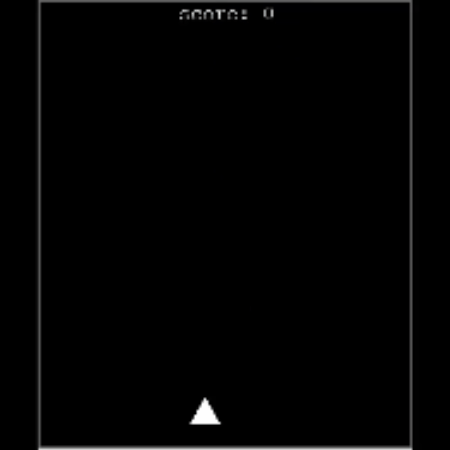

# Space Shooter Game with Python Turtle

This is a space shooter game implemented in Python using the Turtle graphics library. Players control a spaceship to shoot down enemy asteroids, providing an exciting space-themed gaming experience.



## Features

- Classic space shooter gameplay.
- Graphics created with Python's Turtle graphics library.
- Multiple asteroid types.

## Prerequisites

To run this space shooter game, you need to have Python installed on your system. The game uses Python's built-in `turtle` library, so no additional installations are necessary.

## How to Play

1. Clone or download this repository to your local machine.
2. Open your terminal or command prompt.
3. Navigate to the project directory.
4. Run the game using the following command:

   ```bash
   python main.py

## Controls
Use the arrow keys (Up, Down, Left, Right) to move your spaceship.
Press the spacebar to shoot.
